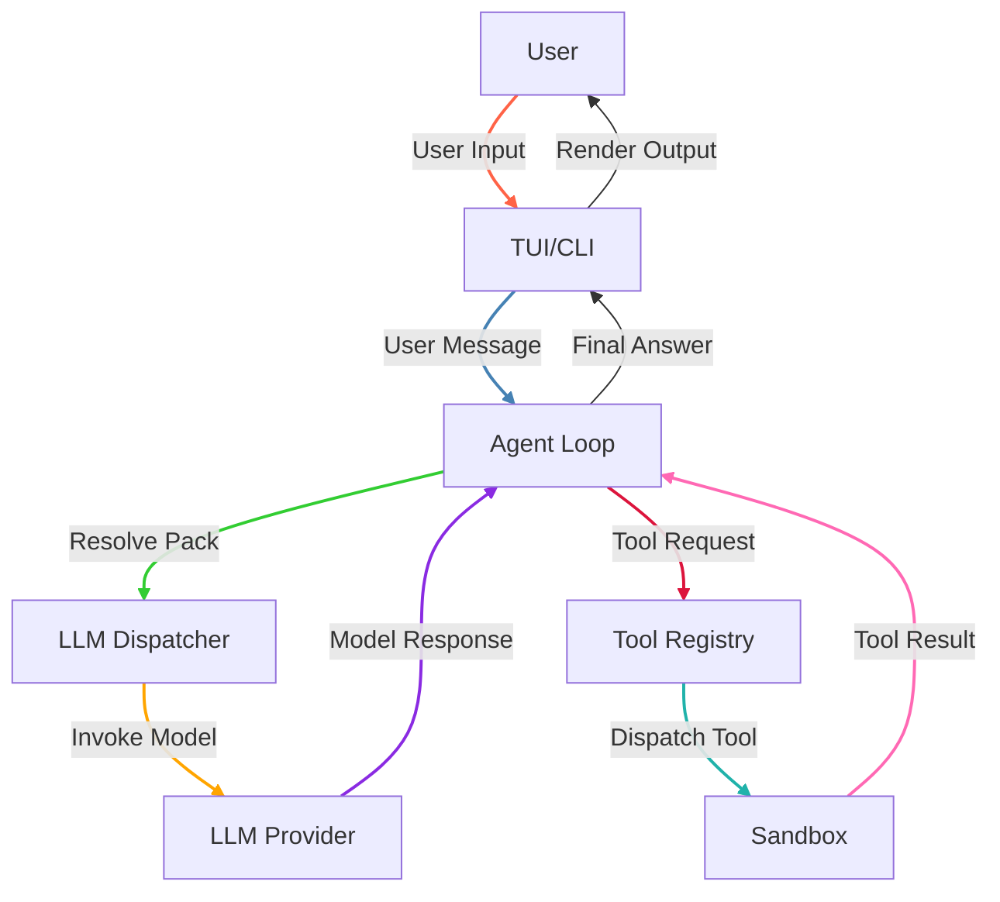
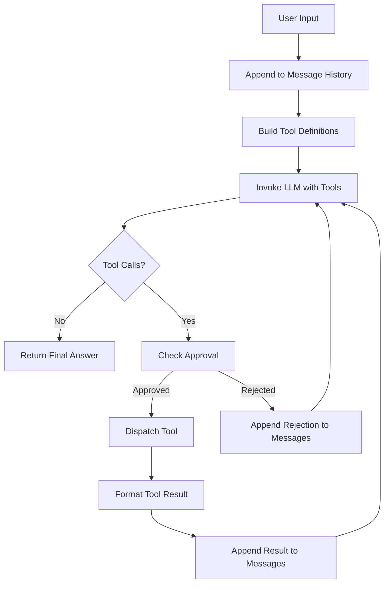
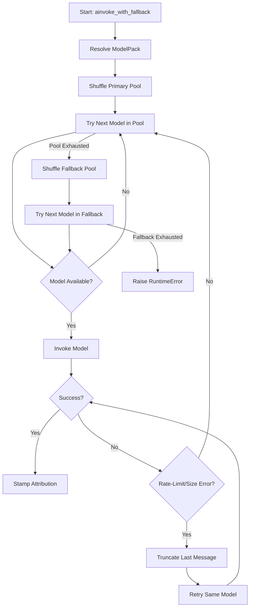
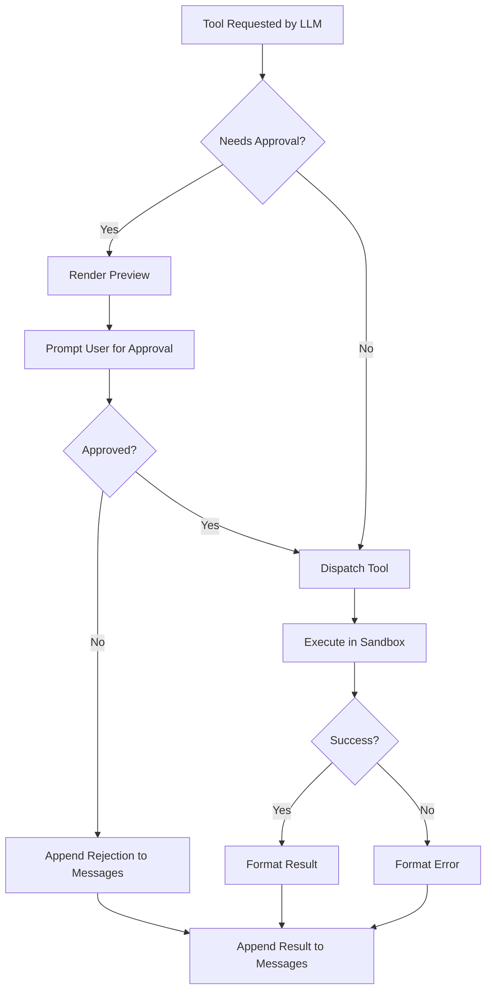

# TesseractCLI

A terminal-native coding agent with configurable LLM providers, model pools, and fallback logic.

## Top-Level Architecture



### Explanation of Data/Function Calls

| Arrow | From          | To               | Data/Function Call/Transaction                                                                 |
|-------|---------------|------------------|------------------------------------------------------------------------------------------------|
| 1     | User          | TUI/CLI         | **User Input**: Text input or command from the user.                                           |
| 2     | TUI/CLI       | Agent Loop       | **User Message**: The user's message is passed to the agent loop for processing.               |
| 3     | Agent Loop     | LLM Dispatcher   | **Resolve Pack**: The agent loop resolves the pack name to select the appropriate model pool.  |
| 4     | LLM Dispatcher | LLM Provider     | **Invoke Model**: The dispatcher invokes the selected model with the message history and tools.|
| 5     | LLM Provider   | Agent Loop       | **Model Response**: The LLM's response, which may include tool calls or a final answer.       |
| 6     | Agent Loop     | Tool Registry    | **Tool Request**: The agent loop requests the tool registry to dispatch a tool.               |
| 7     | Tool Registry  | Sandbox          | **Dispatch Tool**: The tool registry dispatches the tool to the sandbox for execution.         |
| 8     | Sandbox        | Agent Loop       | **Tool Result**: The result of the tool execution, formatted for the LLM.                      |
| 9     | Agent Loop     | TUI/CLI         | **Final Answer**: The agent loop returns the final answer to the TUI/CLI.                      |
| 10    | TUI/CLI       | User            | **Render Output**: The TUI/CLI renders the final answer or tool result to the user.            |

### Key Workflows

1. **User Interaction**:
   - The user inputs a message via the TUI/CLI.
   - The message is passed to the agent loop for processing.

2. **Agent Loop**:
   - The agent loop resolves the appropriate model pack and invokes the LLM.
   - If the LLM requests a tool, the agent loop checks for approval and dispatches the tool.

3. **Tool Execution**:
   - Tools are dispatched to the sandbox for safe execution.
   - The result is formatted and appended to the message history for the LLM to react.

4. **LLM Dispatcher**:
   - The dispatcher selects models from the primary or fallback pools.
   - It handles rate-limit errors by truncating messages and retrying.

5. **Output Rendering**:
   - The TUI/CLI renders the final answer or tool result to the user.

## Overview

TesseractCLI is a command-line tool designed for interacting with multiple LLM providers and models. It supports:
- **Model Pools**: Group models by use case (e.g., `fast_main`, `large_main`, `coding`, `reasoning`).
- **Fallback Logic**: If a primary model fails, the system automatically retries with fallback models.
- **Configuration Management**: Add, remove, or modify packs (pools) and models via CLI or interactive TUI.
- **Provider Support**: Integrates with Mistral, HuggingFace, OpenRouter, and others.

---

## Installation

### Prerequisites
- Python 3.8+
- `.env` file for API keys (see `.env.example` for required variables).

### Steps
1. Clone the repository.
2. Install dependencies:
   ```bash
   pip install -e .
   ```
3. Set up your `.env` file with API keys for the providers you intend to use.

---

## Usage

### CLI Commands

#### Launch the TUI
```bash
tesseract
```
- Launches an interactive terminal UI (TUI) for workspace selection, pack management, and chat.

#### Manage Configuration
```bash
tesseract settings [options]
```
- **List packs and models**:
  ```bash
  tesseract settings --list
  ```
- **Add a pack**:
  ```bash
  tesseract settings --add pool --pack <pack_name>
  ```
- **Add a model to a pack**:
  ```bash
  tesseract settings --add model --pack <pack_name> --provider <provider> --model <model_id>
  ```
- **Add a fallback model**:
  ```bash
  tesseract settings --add model --pack <pack_name> --provider <provider> --model <model_id> --fallback
  ```
- **Remove a pack**:
  ```bash
  tesseract settings --remove pool --pack <pack_name>
  ```
- **Remove a model**:
  ```bash
  tesseract settings --remove model --pack <pack_name> --provider <provider> --model <model_id>
  ```
- **Set a config value**:
  ```bash
  tesseract settings --set <path> <value>
  ```
- **Get a config value**:
  ```bash
  tesseract settings --get <path>
  ```

---

## Configuration

### Default Packs and Models
The system ships with the following default packs (pools) and models:

| Pack Name          | Primary Models                                                                                     | Fallback Models                                      |
|--------------------|---------------------------------------------------------------------------------------------------|------------------------------------------------------|
| `fast_main`        | `mistral-small-2506`, `open-mistral-nemo`                                                       | `ministral-14b-2512`, `ministral-8b-2512`           |
| `large_main`       | `mistral-large-2512`, `deepseek-ai/DeepSeek-V3.1`, `mistral-medium-2508`                         | `moonshotai/Kimi-K2-Instruct`, `mistral-medium-latest` |
| `coding`           | `codestral-2508`, `devstral-2512`                                                                 | `Qwen/Qwen3-Coder-480B-A35B-Instruct`                |
| `small_coding`     | `openai/gpt-oss-20b:free`, `openai/gpt-oss-20b`                                                  | None                                                  |
| `reasoning`        | `Qwen/Qwen3-235B-A22B-Instruct-2507`, `nvidia/nemotron-3-ultra-550b-a55b:free`                   | None                                                  |
| `small_reasoning`  | `google/gemma-3-27b-it`, `mistral-medium-2505`                                                   | None                                                  |
| `free`             | `openrouter/free`, `poolside/laguna-m.1:free`, `openai/gpt-oss-20b:free`, `nvidia/nemotron-3-ultra-550b-a55b:free` | None                                                  |

### Agent Settings
The following agent settings are configurable:

| Setting                  | Default Value | Description                                                                 |
|--------------------------|---------------|-----------------------------------------------------------------------------|
| `temperature`            | `0.7`         | Controls randomness in model responses.                                    |
| `max_iterations`         | `10`          | Maximum number of iterations for agent tasks.                              |
| `timeout_seconds`        | `120`         | Timeout for agent operations.                                              |
| `max_context_messages`   | `40`          | Maximum number of messages to retain in context.                           |

### Paths
| Path            | Default Value | Description                                                                 |
|------------------|---------------|-----------------------------------------------------------------------------|
| `data_dir`       | `data`        | Directory for storing data files.                                          |
| `logs_dir`       | `logs`        | Directory for storing logs.                                                |
| `cache_dir`      | `cache`       | Directory for caching files.                                               |

### Supported Providers
The following providers are supported (with example models for reference):

| Provider       | Example Models                                                                                     |
|----------------|---------------------------------------------------------------------------------------------------|
| Groq           | `llama-3.3-70b-versatile`, `qwen/qwen3-32b`, `gemma2-9b-it`                                     |
| Cerebras       | `llama3.1-8b`, `llama-3.3-70b`                                                                    |
| Mistral        | `mistral-small-latest`, `open-mistral-nemo`                                                       |
| HuggingFace    | `meta-llama/Llama-3.1-8B-Instruct`, `Qwen/Qwen2.5-7B-Instruct`                                   |
| Anthropic      | `claude-sonnet-4-6`, `claude-haiku-4-5`                                                          |
| Together AI    | `meta-llama/Llama-3.3-70B-Instruct-Turbo-Free`                                                    |
| OpenAI         | `gpt-4o-mini`, `gpt-4o`                                                                           |
| Cohere         | `command-r7b`, `command-r-plus`                                                                   |
| OpenRouter     | `meta-llama/llama-3.3-70b-instruct:free`, `qwen/qwen-2.5-7b-instruct:free`                      |
| GitHub Models  | `gpt-4o-mini`, `Meta-Llama-3.1-8B-Instruct`                                                       |
| Local GGUF     | `<path-to-local .gguf file>`                                                                       |

---

## Architecture

### Key Components
- **ConfigManager**: Manages `global_config.yaml` for packs, models, and paths.
- **PacksManager**: Handles adding/removing packs and models.
- **Provider Catalog**: Static list of provider suggestions for UI convenience.
- **TUI**: Interactive terminal interface for workspace, pack, and chat management.

### Inner Agent Loop

The inner agent loop processes a single user message through the following steps:



#### Flow Details:
1. **User Input**: The loop starts with a user message.
2. **Tool Definitions**: Available tools are formatted for the LLM.
3. **Model Invocation**: The LLM is invoked with the current message history and tool definitions.
4. **Tool Calls**: If the LLM requests tool usage:
   - The loop checks if approval is required.
   - If approved, the tool is dispatched.
   - The result (success or error) is formatted and appended to the message history.
5. **Iteration Limit**: The loop repeats until the LLM provides a final answer or the iteration limit is reached.

---

### LLM Dispatcher

The **LLM Dispatcher** is responsible for selecting and invoking models from configured packs. It handles:
- **Model Selection**: Randomized selection from primary and fallback pools.
- **Rate-Limit Handling**: Automatic truncation and retry for rate-limit or context size errors.
- **Tool Binding**: Binding tools to models before invocation.
- **Attribution**: Stamping responses with metadata about the model and pack used.

#### Dispatcher Flow



#### Key Behaviors
1. **Randomized Model Selection**: Models in the **primary pool** and **fallback pool** are shuffled to distribute load.
2. **Fallback Logic**: The fallback pool is only used if all models in the primary pool fail.
3. **Rate-Limit Handling**: If a model fails due to a rate-limit or size error, the dispatcher truncates the last message and retries the **same model** once.
4. **Tool Binding**: Tools are bound to the model before invocation if provided.
5. **Attribution**: The response is stamped with metadata about the model, pack, and hyperparameters used.

---

### Tools

Tools are functions that the LLM can invoke to perform tasks like file operations or command execution. They are registered, sandboxed, and integrated with the agent loop.

#### Tool Registration
- Tools are registered in the `ToolRegistry` using the `add` method.
- Each tool is defined by:
  - A **name** (e.g., `write_file`, `run_command`).
  - A **schema** (Pydantic model for argument validation).
  - A **function** to execute.
  - A **flag** indicating if approval is required.
- Example:
  ```python
  registry.add(
      name="run_command", schema=RunCommandArgs, fn=run_command, needs_approval=True
  )
  ```

#### Sandboxing
- Tools do **not** directly interact with the filesystem or subprocesses.
- Instead, they use the **sandbox** layer:
  - `resolve_in_workspace`: Ensures paths are within the workspace.
  - `safe_open` and `atomic_write`: Safe file operations.
  - `check_command`: Validates commands before execution.
- Example:
  ```python
  policy_result = check_command(command)
  if policy_result.blocked:
      return ToolResult(
          success=False,
          error=f"Command blocked by security policy: {policy_result.reason}",
      )
  ```

#### Tool Execution
- Tools are executed via the `dispatch` method in `ToolRegistry`.
- The function associated with the tool is called with validated arguments.
- Example:
  ```python
  def dispatch(self, name: str, raw_args: dict, workspace_root: Path) -> ToolResult:
      schema, fn, _ = self._tools[name]
      validated = schema(**raw_args)
      return fn(workspace_root=workspace_root, **validated.model_dump())
  ```

#### Integration with Agent Loop
- The agent loop checks if a tool requires approval using `needs_approval`.
- If approval is required, the user is prompted via `approve_tool_call`.
- Approved tools are dispatched, and their results are formatted and appended to the message history.
- Example:
  ```python
  if registry.needs_approval(name):
      approved = await approve_fn(name, args, workspace_root)
  else:
      approved = True

  if approved:
      result = registry.dispatch(name, args, workspace_root)
  ```

#### Tool Flow



#### Key Behaviors
1. **Approval Flow**: Tools like `write_file` and `run_command` require user approval. The user is shown a preview of the action (e.g., diff for file changes, command for execution).
2. **Sandboxing**: All filesystem and command operations are validated and restricted to the workspace.
3. **Error Handling**: Invalid arguments or blocked commands result in a `ToolResult` with an error.
4. **Integration**: Tool results (success or error) are formatted and appended to the message history for the LLM to react.

---

### Design Decisions
- **Fallback Logic**: If a primary model fails, the system retries with fallback models.
- **Environment Modes**: Supports `dev` and `prod` modes via `.env.dev` and `.env.prod`.
- **Configuration Overrides**: Allows overriding `BASE_DIR` for testing.
- **Async and Non-Blocking**: The loop is async and uses `approve_fn` to avoid blocking the event loop, enabling integration with both terminal and UI-based approval flows.

---

## Environment Variables

The following environment variables are required for configuration:

| Variable                  | Description                                                                                     |
|---------------------------|-------------------------------------------------------------------------------------------------|
| `ENV_MODE`                | Set to `dev` or `prod` to load the corresponding `.env` file. Defaults to `dev`.               |
| `CEREBRAS_API_KEY`        | API key for Cerebras.                                                                           |
| `GROQ_API_KEY`            | API key for Groq.                                                                               |
| `MISTRAL_API_KEY`         | API key for Mistral.                                                                            |
| `HUGGINGFACE_API_KEY`     | API key for HuggingFace.                                                                        |
| `ANTHROPIC_API_KEY`       | API key for Anthropic.                                                                          |
| `TOGETHER_API_KEY`        | API key for Together AI.                                                                        |
| `OPENAI_API_KEY`          | API key for OpenAI.                                                                             |
| `COHERE_API_KEY`          | API key for Cohere.                                                                             |
| `OPENROUTER_API_KEY`      | API key for OpenRouter.                                                                         |
| `GITHUB_MODELS_TOKEN`     | Token for GitHub Models.                                                                        |
| `GOOGLE_API_KEY`          | API key for Google.                                                                             |
| `LOCAL_GGUF_MODEL_PATH`   | Path to a local GGUF model file.                                                                |

Example `.env` files are provided for both development (`.env.dev.example`) and production (`.env.prod.example`).

---

## Known Limitations / TODO

1. **Model Suggestions**: The provider catalog is static and not validated against live APIs. Always confirm model IDs with the provider's documentation.
2. **Local GGUF Support**: Requires manual path configuration and is not automatically detected.
3. **Error Handling**: Verbose error logging is disabled by default (`verbose.errors: false`).
4. **Testing**: Test coverage is **not yet included** in the repository.
5. **CI/CD**: Continuous integration and deployment pipelines are **not yet included**.

---

## License

No `LICENSE` file found in the repository.

---

## Acknowledgments

This **README.md** file was written by an AI assistant to provide comprehensive documentation for **TesseractCLI**. TesseractCLI is a terminal-native coding agent designed to offer a seamless and resilient experience with configurable LLM providers, model pools, and fallback logic.

Special thanks to the open-source community for their invaluable contributions and inspiration, which make projects like this possible.

© 2026 **TesseractCLI**. All rights reserved.
