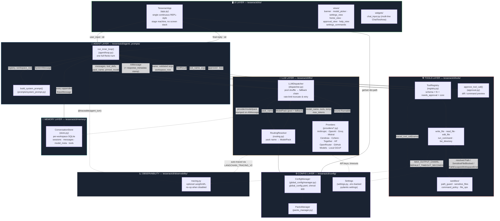
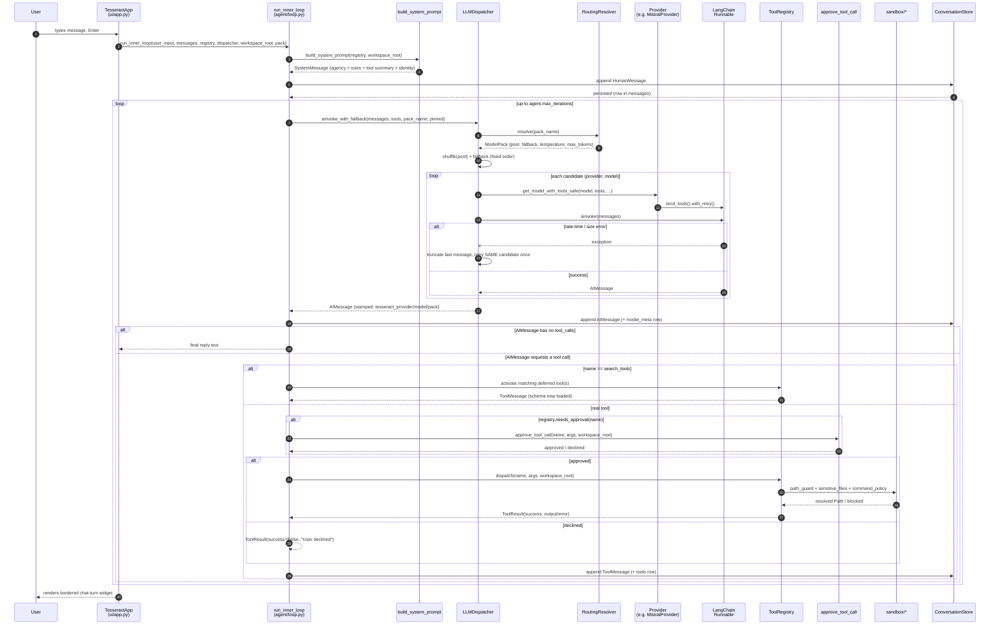
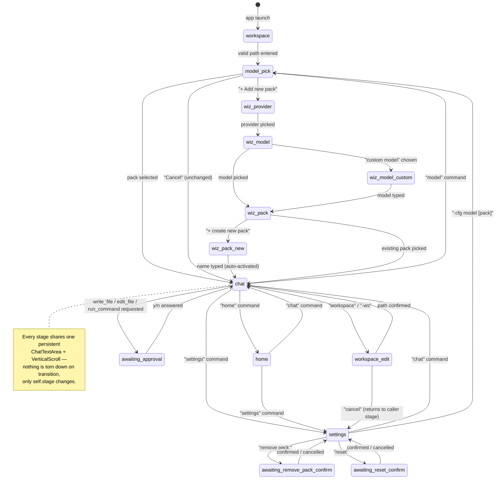
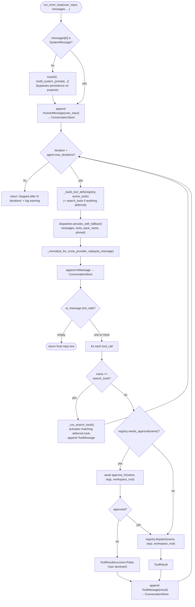
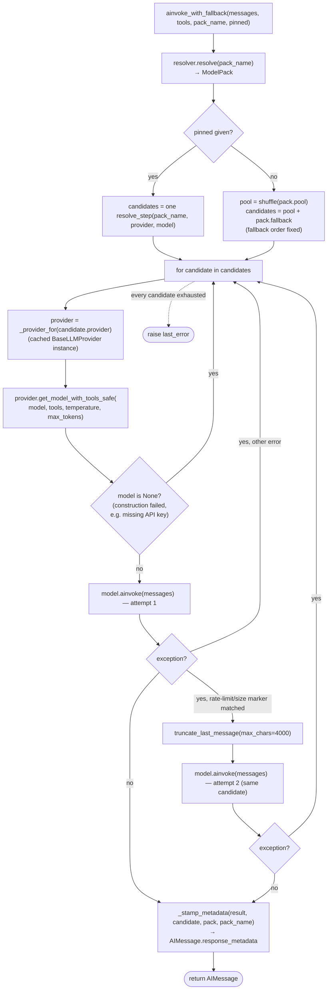
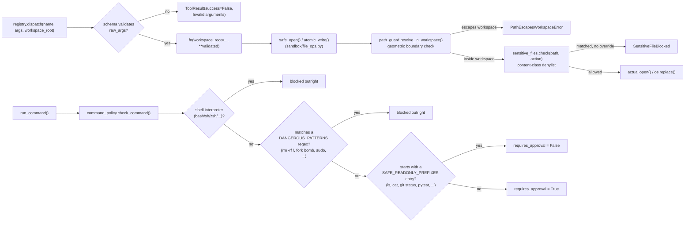
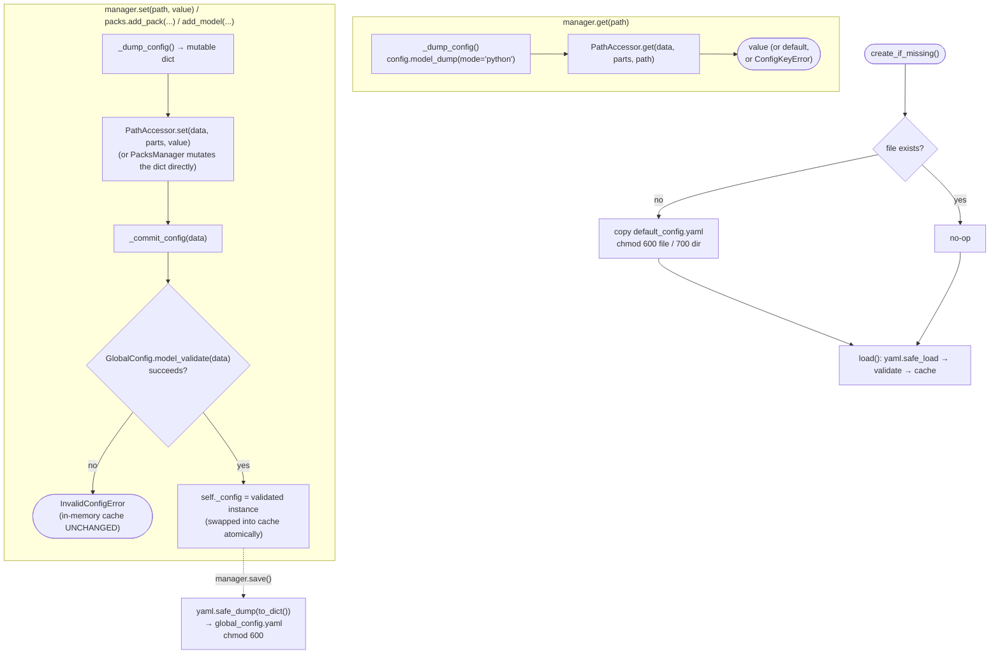
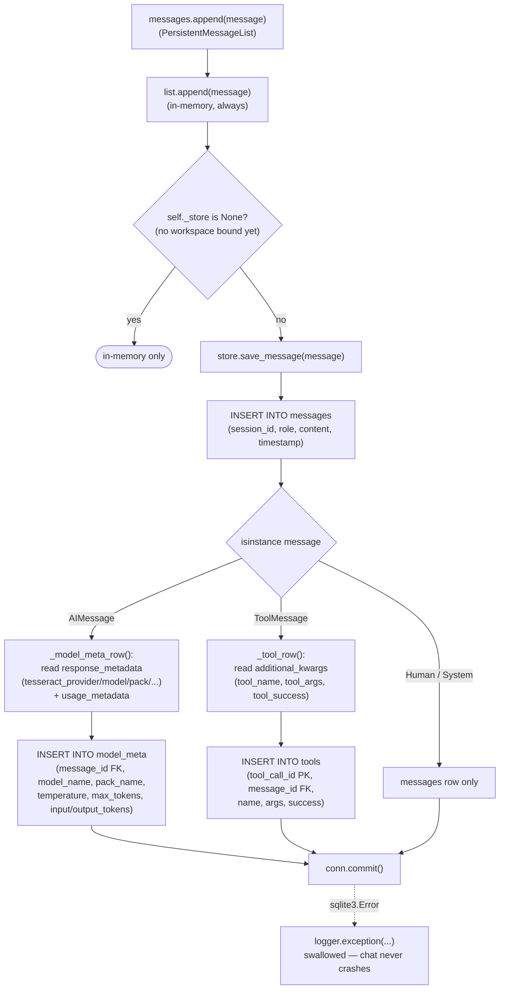
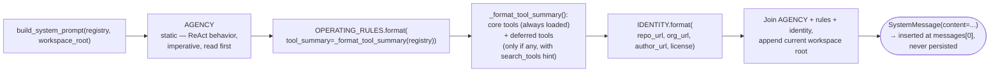

# TesseractCLI-Agent

**A terminal-native, multi-provider coding agent — built from scratch, layer by layer.**

TesseractCLI is not a wrapper around an existing agent framework. The ReAct loop, the
tool-execution sandbox, the multi-provider LLM dispatcher, the config system, and the
Textual-based TUI are all hand-built inside this repository, on top of thin primitives
(`langchain-core` message types, `pydantic`, `textual`) rather than a high-level agent
framework. That choice is deliberate: the goal of this project is to actually understand —
and be able to defend — every architectural decision an agent runtime has to make.

[](https://github.com/zeyadusf/TesseractCLI-Agent/releases)
[](https://www.python.org/)
[](#license)
[](https://github.com/astral-sh/uv)

> Status: **v1.0.0** (stable) · Python 3.11 · package manager: [`uv`](https://github.com/astral-sh/uv)

---

## Table of Contents

- [Why this project exists](#why-this-project-exists)
- [High-level architecture](#high-level-architecture)
- [One turn, end to end](#one-turn-end-to-end)
- [Layers](#layers)
  - [1. UI Layer — Textual TUI](#1-ui-layer--textual-tui)
  - [2. Agent Layer — the ReAct loop](#2-agent-layer--the-react-loop)
  - [3. LLM Layer — dispatcher, routing, providers](#3-llm-layer--dispatcher-routing-providers)
  - [4. Tools Layer — registry, execution, sandbox](#4-tools-layer--registry-execution-sandbox)
  - [5. Config Layer — `ConfigManager` / `PacksManager` / `Settings`](#5-config-layer--configmanager--packsmanager--settings)
  - [6. Memory Layer — per-workspace SQLite persistence](#6-memory-layer--per-workspace-sqlite-persistence)
  - [7. Prompts Layer — system prompt assembly](#7-prompts-layer--system-prompt-assembly)
  - [8. Observability Layer — optional LangSmith tracing](#8-observability-layer--optional-langsmith-tracing)
- [Key architectural decisions](#key-architectural-decisions)
- [Safety model: approval, sandboxing, command policy](#safety-model-approval-sandboxing-command-policy)
- [Configuration: packs, pools, fallbacks](#configuration-packs-pools-fallbacks)
- [Project structure](#project-structure)
- [Installation](#installation)
- [Usage](#usage)
- [Testing](#testing)
- [Roadmap](#roadmap)
- [License](#license)

---

## Why this project exists

This project is not an attempt to fix something wrong with existing coding-agent tools —
it doesn't claim to solve problems other agent frameworks have. The real motivation is
simpler and more personal: it's a self-training project. The ReAct loop, the sandbox, the
multi-provider dispatcher, and the TUI are all built by hand, on top of thin primitives
rather than a high-level agent framework, specifically to push myself to actually understand
— and be able to defend — every decision an agent runtime has to make, not just wire one
together from a framework's building blocks.

At the same time, the goal isn't "a learning exercise that stays a learning exercise." The
intent is to end up with a genuinely usable, **completely free** coding agent that other
people can run and get real value from — not a paid product, not a framework pitch, just a
real tool built while leveling myself up.

---

## High-level architecture

Three layers, strictly separated, each only reachable from its neighbor:



**Reading the arrows:** every arrow is a real function call or a real piece of data crossing
a module boundary — not a conceptual relationship. A dotted arrow means "reads config from"
or "reports to, if enabled" rather than "is driven by."

The three core layers (**UI → Agent → Tools**) are strictly separated: the UI never calls a
tool directly, and the tools layer never imports anything from `ui/`. The only thing that
crosses all three is the `ToolRegistry` and the `workspace_root` — both passed as plain
arguments, never as global state.

---

## One turn, end to end

What actually happens between the user pressing Enter and a reply appearing in the
scrollback — including every fallback and approval branch:



Two details worth calling out because they're easy to get wrong in a ReAct implementation:

- **The system prompt is never persisted.** `run_inner_loop` uses `messages.insert(0, ...)`
  instead of `.append(...)`, which bypasses `PersistentMessageList`'s save-to-SQLite hook on
  purpose — the prompt is regenerated fresh every turn from the *current* registry state, so
  editing it (or toggling which tools are `core`) takes effect immediately, no migration.
- **A declined or failed tool call is not an exception.** It becomes a normal `ToolMessage`
  with `success=False` and a reason, fed straight back into the loop — the model reacts to it
  like any other tool result (retries with different arguments, tries another tool, or
  explains to the user why it's stuck) instead of the turn crashing.

---

## Layers

### 1. UI Layer — Textual TUI

`tesseractcli/ui/`

A single `TesseractApp` (`app.py`) drives the whole interface as **one continuous
stage machine** rather than Textual's `push_screen`/`pop_screen` stack. That rewrite was a
deliberate architectural decision, not an accident of growth: separate screens for welcome /
workspace-selector / model-picker / chat made the input widget get torn down and rebuilt on
every navigation, which broke continuity (mid-conversation scrollback, cursor state). One
`self.stage` string property now decides how `_route_input` dispatches free text
(`workspace`, `workspace_edit`, `awaiting_approval`, `model_pick`, `settings`, `home`,
`chat`, and several `wiz_*` sub-stages for the pack-creation wizard).



Key components:

| Component | Responsibility |
|---|---|
| `app.py` | Stage state machine, command routing, scrollback rendering |
| `SelectableStatic` | One mouse-selectable widget per scrollback entry (`ALLOW_SELECT = True`) — replaced the earlier `RichLog`, which could append but never remove/select a line |
| `views/model_picker.py` | Inline `OptionList` pack picker — "+ Add new pack" and "Cancel" options, arrow-key navigable |
| `views/settings_view.py` / `settings_commands.py` | Dot-path config editing, pack/model add-remove, backups, raw read-only YAML view |
| `views/home_view.py` | Workspace + active-pack summary and command list |
| `views/approval_view.py` | Bordered tool-approval prompt (diff / command preview) |
| `widgets/chat_input.py` | Multi-line `ChatTextArea`, fires `Submitted` on Enter |

**Out arrow:** the UI's only call into the agent layer is `run_inner_loop(...)`, awaited from
the Textual event loop — approval is injected as an `async` callback
(`approve_fn`), so a Textual modal can resolve it without `agent/loop.py` knowing a TUI
exists at all. The default `_default_approve_fn` (terminal `input()`) runs via
`asyncio.to_thread` so it never blocks the event loop even outside Textual.

---

### 2. Agent Layer — the ReAct loop

`tesseractcli/agent/loop.py`

`run_inner_loop()` is **one full turn for one user message** — not the outer
"wait for the next message" session loop, which belongs to the UI. It:

1. Prepends a fresh `SystemMessage` if the history doesn't already start with one.
2. Appends the user's `HumanMessage`.
3. Builds the currently-active tool schema list (`_build_tool_defs`) — scoped to
   `core_tool_names()` only when `agent.lazy_tool_loading` is on, otherwise every
   registered tool.
4. Calls `dispatcher.ainvoke_with_fallback(...)`, gets back an `AIMessage`.
5. If it has no `tool_calls` → that's the final reply, return it.
6. If it does → for each call: resolve `search_tools` internally (see below), or check
   `registry.needs_approval(name)`, await approval if needed, `dispatch()` through the
   registry, and append the resulting `ToolMessage`.
7. Repeat until a tool-call-free reply or `agent.max_iterations` is hit.



**Lazy tool loading** (`agent.lazy_tool_loading`, default `False`) is the mechanism that
keeps per-request tool context flat as the tool count grows: tools marked `core=False` are
only exposed to the model as a one-line name + description in the system prompt. The model
must call the meta-tool `search_tools(query)` — intercepted directly inside the loop, never
routed through `registry.dispatch` since it isn't a real tool, it mutates the loop's own
`active_tools` set — before that tool's full JSON schema is added to what's sent next turn.
All five shipped tools currently register with `core=True`, so this path is fully wired but
dormant until a future tool opts into `core=False`.

**Cross-provider replay normalization:** some models return an `AIMessage` with both
narration text *and* `tool_calls` set. Anthropic tolerates replaying that back as history;
OpenAI-compatible endpoints (Mistral, Cerebras — both routed through `ChatOpenAI`) reject it
with a 400. `_normalize_for_cross_provider_replay` blanks `.content` whenever both are
present, specifically so a pack that mixes providers across pool/fallback doesn't crash mid
fallback chain.

---

### 3. LLM Layer — dispatcher, routing, providers

`tesseractcli/llm/`

Three responsibilities, cleanly split:

- **`routing.py` — `RoutingResolver`**: resolves a *pack name* (e.g. `"coding"`,
  `"fast_main"`) to a `ModelPack` read straight from the shared `ConfigManager`. It owns no
  state of its own and caches nothing — every `.resolve()` call reads the manager's current
  in-memory config, so a `set` from the settings screen takes effect on the *next* call, not
  after a restart. Falls back to `DEFAULT_PACK_NAME = "fast_main"` for an unknown/missing
  pack.

- **`dispatcher.py` — `LLMDispatcher`**: the single entry point the rest of the app goes
  through for a model call. Given a resolved pack, it builds the ordered candidate list —
  **the pool, shuffled per call** (so repeated calls spread load across free-tier providers
  instead of always hammering `pool[0]`), **followed by the fallback list in its declared,
  fixed order** (fallbacks are a deliberate priority, never shuffled). For each candidate it
  gets a cached, retry-wrapped `Runnable` from that provider and invokes it; on a detected
  rate-limit/size error it truncates *only the last message* and retries the *same* candidate
  once before moving to the next one. Whichever candidate answers gets its
  provider/model/pack/temperature/max_tokens stamped onto the returned `AIMessage`'s
  `response_metadata`, which is exactly what `memory/store.py` later reads to fill the
  `model_meta` table.

- **`providers/*.py` — `BaseLLMProvider` subclasses**: one per backend (Anthropic, OpenAI,
  Groq, Mistral, Cerebras, Cohere, Together, HuggingFace, OpenRouter, GitHub Models, Local
  GGUF, Google). Every provider caches its raw `BaseChatModel` (`_get_raw_model`) so
  `.bind_tools()` and `.with_retry()` are only ever built once per (model, kwargs) pair. Note
  the wrap order: `bind_tools()` happens **before** `with_retry()` — `RunnableRetry` doesn't
  proxy `bind_tools`, so reversing this breaks the tools binding silently.
  `get_model_safe`/`get_model_with_tools_safe` swallow construction errors (e.g. a missing
  API key) and return `None` instead of raising, which is exactly what lets the dispatcher
  skip a broken candidate and move to the next one in the chain rather than crashing the
  whole turn.

Rate-limit/size detection is a **heuristic string match** against the raised exception's
text (`"rate limit"`, `"429"`, `"context_length_exceeded"`, `"payload too large"`, …) rather
than a shared exception type — there isn't one across this many independent LangChain
integrations.



---

### 4. Tools Layer — registry, execution, sandbox

`tesseractcli/tools/`

`ToolRegistry` (`registry.py`) stores, per tool name, a 4-tuple:
`(schema: type[BaseModel], fn: Callable, needs_approval: bool, core: bool)`. Two of those
fields are deliberately **developer-set at registration time, never model-controllable**:

- `needs_approval` never lives inside a tool's pydantic `Args` model — if it did, a tool-call
  JSON payload from the model could set it, which is a trust-boundary violation. It's set
  only in `registry.add(...)`.
- The approval function itself (`approve_tool_call`) is **never registered as a tool** —
  registering it would expose it to the model via `tool_specs()`. It's imported and called
  directly from `agent/loop.py`.

Current registration (`tools/registry_builder.py`):

| Tool | `needs_approval` | What it does |
|---|:---:|---|
| `read_file` | ❌ | Read a file (optionally a line range) inside the workspace |
| `list_directory` | ❌ | List a directory inside the workspace |
| `write_file` | ✅ | Overwrite or append a file — atomic write, temp file + `os.replace` |
| `edit_file` | ✅ | Find-and-replace with a uniqueness requirement on `old_str` (rejects ambiguous matches) |
| `run_command` | ✅ | Execute a command as `list[str]` with `shell=False` |

**Every tool call — successful or failed — flows through `tools/sandbox/`** before it
touches the filesystem or a subprocess:



- **`path_guard.py`** — deterministic geometric check: is the resolved path still inside
  `workspace_root`? No heuristics involved.
- **`sensitive_files.py`** — a *separate* content-class denylist (secrets, credentials,
  private keys), with **independent read vs. write denylists**, an `ALLOWLIST_OVERRIDES`
  list checked *before* the denylist (e.g. `.env.example` should never be blocked), and
  symlink resolution before matching so a symlink can't be used to dodge the check.
- **`command_policy.py`** — three explicit layers, documented in the module itself as
  *not* a complete security boundary on their own: (1) block direct shell-interpreter
  invocation outright — `shell=False` alone doesn't help if the command **is** `bash -c
  "..."`, since the interpreter becomes the shell; (2) a denylist of known-dangerous regex
  patterns (acknowledged as non-exhaustive — `python3 -c "shutil.rmtree('/')"` isn't caught
  by any `rm`-based pattern); (3) a small, conservative **default-deny allowlist**
  (`ls`, `cat`, `grep`, `git status`, `pytest`, …) for auto-approval — everything else routes
  through the human approval gate.
- **`file_ops.py`** — the single place both checks (boundary, then sensitivity) are enforced
  centrally, inside `safe_open()` and `atomic_write()`, so the ordering is guaranteed by
  construction rather than relying on every tool remembering to call both checks itself.

`approval.py` renders what the human actually sees before approving: `write_file` shows only
the *changed portion* of a diff (not the whole file, even for large ones); `edit_file` builds
its colored diff directly from the tool call's `old_str`/`new_str` (no disk read needed) —
accepted trade-off: this shows old-text-removed / new-text-added as two blocks rather than a
fine-grained word-level diff.

---

### 5. Config Layer — `ConfigManager` / `PacksManager` / `Settings`

`tesseractcli/config/`

Two separate configuration systems, on purpose, because they have different lifecycles and
different sensitivity:

- **`global_config/manager.py` — `ConfigManager`**: the single source of truth for
  `global_config.yaml` (packs, pools, fallbacks, agent behavior, paths). Lazily loaded and
  cached in memory; `load()`/`reload()`/`reset()` are the only calls that touch disk for
  reads. `get(path)`/`set(path, value)` use dot-notation (`"agent.temperature"`,
  `"providers.main.max_tokens"`) resolved through `PathAccessor`; every `set()` re-validates
  the *entire* resulting config against the `GlobalConfig` pydantic schema before committing
  it to the in-memory cache — an invalid value never gets partially applied. The config file
  (and its directory, and every timestamped backup under `backups/`) is `chmod 600` /
  `700` on POSIX, since a pack entry may eventually carry credentials. `PacksManager` (its
  `packs` attribute) owns everything about adding/removing packs and pool/fallback model
  entries — `ConfigManager` itself implements none of that logic, only the
  `_dump_config`/`_commit_config` read/write hooks `PacksManager` uses.

- **`settings.py` — `Settings`**: flat, `.env`-backed `pydantic-settings`, for things that
  are genuinely process-level rather than structured domain config — API keys, default
  timeouts (`DEFAULT_TIMEOUT_SECONDS`), output truncation limits (`MAX_OUTPUT_CHARS`),
  LangSmith tracing toggles. Deliberately **not** merged into `global_config.yaml`: routing
  data has its own future lifecycle (multi-pack UI editing, `routing.json`-style
  serialization down the line) and shouldn't be coupled to `.env` parsing.

The shipped `default_config.yaml` seeds seven packs out of the box (`fast_main`,
`large_main`, `coding`, `small_coding`, `reasoning`, `small_reasoning`, `free`), each with its
own `temperature`, `max_tokens`, `pool`, and `fallback` — see
[Configuration](#configuration-packs-pools-fallbacks) below.



---

### 6. Memory Layer — per-workspace SQLite persistence

`tesseractcli/memory/store.py`

Deliberately minimal in scope: every message is written to disk **as soon as it's appended**
to the in-memory list, so a crash never loses what was already said. Resuming a past session
on startup is intentionally *not* implemented yet — but the schema is shaped so that feature
won't need a migration when it lands.

`PersistentMessageList` is a drop-in `list[BaseMessage]` subclass — every existing
`messages.append(...)` call site in `agent/loop.py` needed **zero changes** — that also
writes through to a bound `ConversationStore` on every append. Unbound, it behaves like a
plain list (lets the UI construct it before a workspace is even picked).

One SQLite file per workspace, keyed by a stable hash of the workspace's resolved absolute
path (`db_store/<sha256[:16]>/conversation.db`), **not** stored as a column — it's purely the
on-disk partition key:

| Table | Grain | Notable columns |
|---|---|---|
| `sessions` | one row per app open/bind | `session_id` (fresh `uuid4` every time, unlike an earlier single-persistent-id design) |
| `messages` | one row per message, role-agnostic | `role`, `content`, `timestamp` |
| `model_meta` | 1:1 with an assistant message | `model_name`, `pack_name`, `temperature`, `max_tokens`, `input_tokens`/`output_tokens` (from `dispatcher.py`'s stamp + LangChain's own `usage_metadata`) |
| `tools` | one row per executed tool call | keyed by `tool_call_id` itself — already a unique natural key, no synthetic id needed |

WAL journal mode + `check_same_thread=False` is a deliberate pairing: tool approval runs the
terminal prompt via `asyncio.to_thread`, so the connection may be touched from more than one
OS thread; WAL keeps a reader from blocking on that occasional cross-thread write. A
persistence failure (`sqlite3.Error`) is logged and swallowed, never raised — chat history
must never take the conversation down.

**Known, accepted gap:** if the inner loop stops mid-call (e.g. `agent.max_iterations` hit
right as a tool call was requested), that one request's args are never persisted — there's no
`ToolMessage` row for them to attach to yet. Rare enough to defer.



---

### 7. Prompts Layer — system prompt assembly

`tesseractcli/prompts/system_prompt.py`

`build_system_prompt(registry, workspace_root)` is called fresh at the start of every
`run_inner_loop`, never persisted (see [Agent Layer](#2-agent-layer--the-react-loop)). It's
assembled in a specific, intentional order:

1. **`AGENCY`** — an explicit, imperative "how you work" block, placed **first** because the
   smaller/weaker a model is, the more its behavior is dominated by whatever sits earliest in
   the prompt. "Call the tool" beats "you are able to call tools."
2. **`OPERATING_RULES`** — sandbox boundaries, the approval contract, "never claim success
   without a tool result confirming it," and the always-on tool summary
   (`_format_tool_summary`, built from `registry.brief_specs()` — name + first docstring line
   only, split into "always loaded" vs. "not loaded yet, call `search_tools`").
3. **`IDENTITY`** — who built it, repo/author links, license — kept short and *last*, since
   it's the least attention-critical part; only answered when asked.

The tool-summary section is **conditionally worded**: it only mentions `search_tools` as a
real capability when `registry.deferred_tool_names()` is actually non-empty — telling the
model about a capability it doesn't have access to that turn would be worse than not
mentioning it.



---

### 8. Observability Layer — optional LangSmith tracing

`tesseractcli/observability/tracing.py`

Follows the same "safe degradation" pattern as the provider layer: if `langsmith` isn't
installed, or `LANGSMITH_TRACING` isn't explicitly enabled in `Settings`, every helper here
becomes a no-op — nothing in `agent/loop.py` or `tools/registry.py` ever has to branch on
"is tracing on?" Three distinct things are traced, for three distinct reasons:

1. **LLM calls** are traced *automatically* once `LANGCHAIN_TRACING_V2=true` is set — every
   provider model is a LangChain `BaseChatModel`, which reports to LangChain's own global
   callback manager with zero code change in `dispatcher.py`.
2. **Tool execution** is plain Python, not a LangChain `Runnable` — it is *not* auto-traced.
   `traced_tool_call(name, inputs)` wraps one `dispatch()` call in an explicit run named
   after the real tool (`"edit_file"`, `"run_command"`, …), which a static `@traceable`
   decorator couldn't do since the tool name is only known at dispatch time.
3. **The whole turn** — `run_inner_loop` is wrapped with `@traceable(name="agent_turn",
   run_type="chain")`, so every model attempt across the pool+fallback chain, and every tool
   call for that turn, show up as **one trace tree**, not disconnected top-level runs.

---

## Key architectural decisions

A running log of decisions that shaped the codebase, and the reasoning behind each one:

- **`shell=False` everywhere, command as `list[str]`.** Eliminates shell injection by
  construction rather than by escaping. `command_policy.py`'s first layer additionally blocks
  invoking a shell interpreter *as the command itself* (`bash -c "..."`), since that would
  reintroduce shell interpretation even under `shell=False`.
- **`needs_approval` and the approval function are structurally kept out of model reach.**
  Not a policy choice enforced by convention — the model literally has no path to set
  `needs_approval` (it isn't a schema field) or call the approval function (it isn't
  registered as a tool).
- **Both boundary check and sensitivity check live in one gate (`file_ops.py`), not spread
  across each tool.** Guarantees the check order (boundary, then content-class) by
  construction — no tool can accidentally skip one.
- **Pool entries are shuffled per call; fallback entries never are.** The pool is a set of
  interchangeable "good enough" options (spread load, avoid hammering one free-tier
  provider); the fallback list is a deliberate priority order and shuffling it would silently
  change behavior the user configured on purpose.
- **`RoutingResolver` and `LLMDispatcher` never cache config values across calls** — every
  read goes straight to `ConfigManager`'s current in-memory state, so a `set` from the
  settings screen (or the `tesseract settings --set` CLI) takes effect on the very next
  model call or turn, with no restart and no explicit cache-invalidation call anywhere.
- **`bind_tools()` before `with_retry()`, never the reverse**, because `RunnableRetry` doesn't
  proxy `bind_tools` — getting this order backwards silently drops tool-calling capability
  with no error.
- **A failed or declined tool call is delivered back to the model as a normal `ToolMessage`,
  not an exception.** Keeps the ReAct loop uniform — the model always sees "here's what
  happened," success or not, and can decide how to react itself.
- **Rate-limit detection is a heuristic string match, not typed exception handling**, because
  there is no single shared exception type across this many independent LangChain provider
  integrations. Documented as a known, accepted limitation rather than a bug.
- **The system prompt is rebuilt every turn and deliberately excluded from persistence**
  (`insert(0, ...)` instead of `.append(...)`), so prompt/tool-registration changes apply
  immediately with no data migration.
- **The UI never imports from `tools/` or `llm/` directly** — its only contact point with the
  agent internals is `run_inner_loop(...)` and the `approve_fn` callback it injects. This is
  what let the whole UI layer be rewritten (screen-stack → single stage machine) without
  touching the agent or tools layers at all.

---

## Safety model: approval, sandboxing, command policy

Defense in depth, deliberately layered rather than relying on one mechanism:

1. **Structural boundary** — `path_guard.py`'s geometric check: every file path is resolved
   and verified to still live inside `workspace_root` before anything touches disk.
2. **Content-class denylist** — `sensitive_files.py`: even *inside* the workspace, files
   matching secret/credential/key patterns are blocked for read and/or write, independently
   of the path-boundary check, with symlink resolution so a symlink can't dodge it.
3. **Command policy** — `command_policy.py`: shell-interpreter block → dangerous-pattern
   denylist → default-deny allowlist, explicitly documented as *one* layer of defense in
   depth, not a complete security boundary (true isolation ultimately needs OS/process-level
   sandboxing, which is out of scope for this layer).
4. **Human approval gate** — `write_file`, `edit_file`, and `run_command` require explicit
   approval by default (`needs_approval=True`); `read_file` and `list_directory` don't. The
   approval UI renders a diff (for file changes) or the exact command (for shell execution)
   before the human decides.

Every one of these can independently reject a call — the tool function only ever runs if all
of them pass.

---

## Configuration: packs, pools, fallbacks

A **pack** is a named routing target (`fast_main`, `coding`, `reasoning`, …) with its own
`temperature`, `max_tokens`, a **pool** of interchangeable primary models, and a **fallback**
list tried in fixed order if every pool entry fails. `agent/loop.py` never picks a raw
provider/model pair directly — it always resolves a pack name (or `None`, which falls back to
`fast_main`) through `RoutingResolver`.

```yaml
# tesseractcli/config/global_config/default_config.yaml (excerpt)
providers:
  coding:
    temperature: 0.10
    max_tokens: 16384
    pool:
      - provider: mistral
        model: codestral-2508
      - provider: mistral
        model: devstral-2512
    fallback:
      - provider: huggingface
        model: Qwen/Qwen3-Coder-480B-A35B-Instruct

agent:
  temperature: 0.7
  max_iterations: 15
  timeout_seconds: 120
  max_context_messages: 40
  lazy_tool_loading: false
```

Seven packs ship by default — `fast_main` (the fallback-of-last-resort default),
`large_main`, `coding`, `small_coding`, `reasoning`, `small_reasoning`, and `free` (all
free-tier OpenRouter models, no key required to try the agent end to end).

**From inside the TUI** (`settings` stage — bare-word grammar, parsed by
`ui/views/settings_commands.py::handle()`):

```text
packs                                       list every pack + the models inside it
pack <name>                                 show one pack in full detail
suggest                                     provider/model suggestions          (-s)
add pack <name>                             create a new empty pack             (-a -p <name>)
remove pack <name>                          delete a pack — asks for            (-rm -p <name>)
                                             'remove pack <name> confirm'
rename pack <old> <new>                     rename a pack                       (-rn)
add model <pack> <provider> <model> [fallback]     add a model (pool by default)
remove model <pack> <provider> <model> [fallback]  remove a model — also asks to confirm
set <dot.path> <value>                      write any scalar config value
get <dot.path>                              read any scalar config value
yaml                                        view global_config.yaml (read-only)
backup / backups / restore [latest|file]    manual config backup & restore
validate                                    re-validate the current config
```

Example session:

```text
> add pack vision
> add model vision openai gpt-4o-mini
> add model vision huggingface Qwen/Qwen3-235B-A22B-Instruct-2507 fallback
> set agent.max_iterations 20
> get agent.temperature
```

**Headlessly, without launching the TUI at all** — `tesseract settings ...`
(`__main__.py`, its own smaller argparse-based subset, useful for scripting/CI):

```bash
tesseract settings --list
tesseract settings --suggest
tesseract settings --add pool --pack vision
tesseract settings --add model --pack vision --provider openai --model gpt-4o-mini
tesseract settings --add model --pack vision --provider openai --model gpt-4o-mini --fallback
tesseract settings --set agent.max_iterations 20
tesseract settings --get agent.temperature
```

Both interfaces go through the exact same `ConfigManager`/`PacksManager` — there is only ever
one `global_config.yaml` on disk, so a pack added from the shell shows up in the TUI's pack
picker immediately, and vice versa. The TUI grammar is the richer of the two (rename,
backup/restore, raw YAML view, delete confirmation); the CLI subcommand only covers add/remove
pool-or-model and generic get/set.

---

## Project structure

```
tesseractcli/
├── agent/
│   └── loop.py                  # run_inner_loop() — the ReAct turn
├── config/
│   ├── settings.py               # .env-backed pydantic-settings (API keys, timeouts)
│   ├── logger.py
│   ├── provider_catalog.py       # suggestion data for the settings "suggest" wizard
│   └── global_config/
│       ├── manager.py            # ConfigManager — global_config.yaml lifecycle
│       ├── packs_manager.py      # PacksManager — pack/pool/fallback CRUD
│       ├── paths_manager.py      # PathAccessor — dot-notation get/set
│       └── default_config.yaml   # shipped default packs
├── llm/
│   ├── dispatcher.py             # LLMDispatcher — pool shuffle, fallback, retry
│   ├── routing.py                # RoutingResolver — pack name -> ModelPack
│   └── providers/                # one BaseLLMProvider subclass per backend
├── tools/
│   ├── registry.py               # ToolRegistry
│   ├── registry_builder.py       # build_registry() wiring
│   ├── approval.py                # diff/command preview + approve_tool_call
│   ├── write_file.py / read_file.py / edit_file.py
│   ├── exec_tool.py               # run_command
│   ├── list_directory.py
│   └── sandbox/
│       ├── path_guard.py          # workspace boundary check
│       ├── sensitive_files.py     # content-class denylist
│       ├── command_policy.py      # shell/command safety layers
│       └── file_ops.py            # safe_open() / atomic_write() — the single gate
├── memory/
│   └── store.py                   # ConversationStore, PersistentMessageList
├── prompts/
│   └── system_prompt.py           # build_system_prompt()
├── observability/
│   └── tracing.py                 # optional LangSmith wiring
├── models/
│   ├── config_models/             # GlobalConfig, ModelPack, ModelConfig, ...
│   ├── tool_models/                # ToolResult, per-tool Args/Metadata
│   └── exceptions.py
├── ui/
│   ├── app.py                     # TesseractApp — the whole TUI
│   ├── logo.py
│   ├── views/                     # banner, pickers, settings/home/help/approval
│   └── widgets/                   # chat_input.py
└── __main__.py                    # `tesseract` / `tesseract settings ...` entrypoint
```

---

## Installation

`pyproject.toml` declares a real console-script entry point
(`[project.scripts] tesseract = "tesseractcli.__main__:main"`), so it can be installed as a
**global CLI tool** — the `tesseract` command becomes available from any directory, in any
terminal, without activating a virtualenv every time. Requires **Python 3.11** (pinned in
`pyproject.toml` as `>=3.11,<3.12`) — `uv` resolves and manages that interpreter
automatically in every option below.

### 1. Clone the repository

```bash
git clone https://github.com/zeyadusf/TesseractCLI-Agent.git
cd TesseractCLI-Agent

# add provider API keys to .env — at minimum whichever provider(s)
# your active packs point at (see default_config.yaml)
cp .env.example .env
```

### 2. Install globally (recommended)

Installs `tesseract` into an isolated tool environment and puts it on your `PATH` — the same
idea as `pipx install .`. Once installed this way, `tesseract` works from **any** directory,
no venv activation needed:

```bash
uv tool install .

# pick up code changes without a full reinstall, while developing:
uv tool install --editable .

# now usable from anywhere:
cd ~/some/other/project && tesseract
```

### 3. Or install locally, project-scoped only (alternative)

Keeps everything inside this repo's own virtual environment — only works when run from
inside the cloned folder (`uv run tesseract`), no global `tesseract` command:

```bash
uv sync
uv run tesseract
```

---

## Usage

```bash
# launch the interactive TUI (installed globally, works from any directory)
tesseract

# or manage global_config.yaml headlessly, no TUI —
# same underlying ConfigManager, changes are shared with the TUI instantly
tesseract settings --list
tesseract settings --suggest
tesseract settings --set paths.data_dir /tmp/tesseract-data
```

Inside the TUI, bare-word commands (no slash prefix) navigate between stages —
`chat`, `settings`, `home`, `model` — and a set of shorthand flags
(`-cfg model <pack>`, `-ws <path>`, `-rm -p <pack>`, …) let you jump directly between them
without leaving the chat. See
[Configuration](#configuration-packs-pools-fallbacks) for the full settings-stage command
grammar (`packs`, `add pack`, `add model`, `set`/`get`, `backup`/`restore`, …).

---

## Testing

```bash
uv run pytest
```

Coverage includes provider contract tests (one shared `_contract.py` exercised against every
provider), the dispatcher's fallback/retry behavior, routing resolution, the full sandbox
layer (path escapes, sensitive-file denylist with symlink resolution, command policy), and
the tool registry/dispatch path.

---

## Roadmap

**v1.0.0 is Phase 1 (MVP) — shipped, and hardened well past its original scope.** The original
MVP spec called for 3 tools with no fallback logic and a flat message table; what's actually in
this release is 5 tools, a shuffled-pool + ordered-fallback dispatcher across 11 providers, a
normalized 4-table persistence schema, lazy tool-schema loading, and optional LangSmith tracing —
none of which were required for "MVP done," but all of which came out of building the MVP
properly rather than minimally.

What's ahead is organized the same way the original project vision phased it — cheapest / most
foundational first:

### Phase 2 — Memory depth & context budgeting
- [x] Real Settings screen (TUI + headless CLI, dot-path get/set, packs/pools/fallback CRUD)
- [x] Sliding-window context cap (`agent.max_context_messages`) as a stopgap
- [ ] Hierarchical memory: raw log → rolling Level‑1 summaries → Level‑2 summary-of-summaries,
      escalating only when the cheaper tier can't answer
- [ ] `pgvector` semantic search as the fallback tier once summarization exists — not a primary
      retrieval path
- [ ] Explicit per-component context token budgets (memory / tool output / system prompt),
      config-driven rather than hardcoded
- [ ] Resuming a persisted session on startup — the SQLite schema (`memory/store.py`) already
      supports this; the read path doesn't exist yet

### Phase 3 — Effort controls, real isolation, distribution
- [ ] `default / medium / hard` reasoning-effort and retrieval-depth settings, as two distinct
      configurable axes (not one merged "difficulty" slider)
- [ ] Docker-based sandboxing for `run_command`, on top of (not replacing) the current
      shell-block / dangerous-pattern / default-deny policy layers — for genuine OS-level
      command isolation
- [ ] PyPI publish (the `release.yml` workflow builds and smoke-tests the wheel already; the
      publish step is deliberately left commented out pending a distribution decision)
- [ ] Optional `Dockerfile` for a fully isolated run, independent of the `pip`/`uv tool install`
      path

### Phase 4 — Multi-model parallel code generation (experimental)
- [ ] Planner model decomposes a task into modules with fixed interfaces *before* any parallel
      work starts
- [ ] N models generate against those locked interfaces concurrently, one module each
- [ ] A reviewer pass merges and checks cross-module consistency
- [ ] Starting scope is deliberately narrow — independent unit tests, not whole features — until
      the planner/interface-lock pattern is proven

### Near-term polish (not phase-gated)
- Real mouse text-selection refinements and further TUI polish
- Expanding `core=False` tool registrations to exercise the lazy-loading path in practice

Full context on the reasoning behind each phase — including the sandbox escalation ladder and
why naive multi-model parallelism doesn't work for code — lives in `PROJECT_VISION.md`.

---

## License

MIT — see the repository for the full license text.

---

Built by **Zeyad El-Sayed** ([@zeyadusf](https://github.com/zeyadusf)) as part of the
**Tesseract AI** family of open-source projects.
